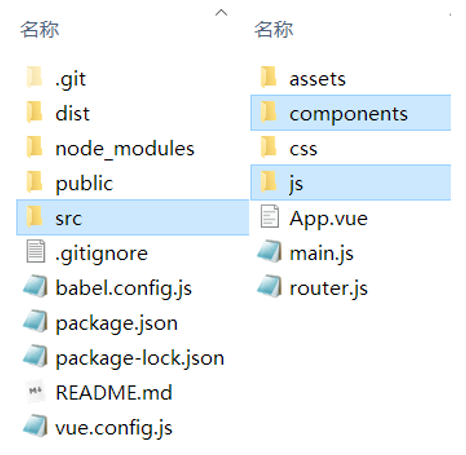
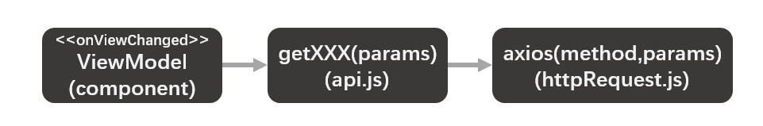
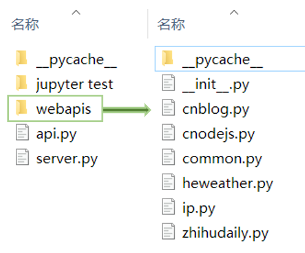
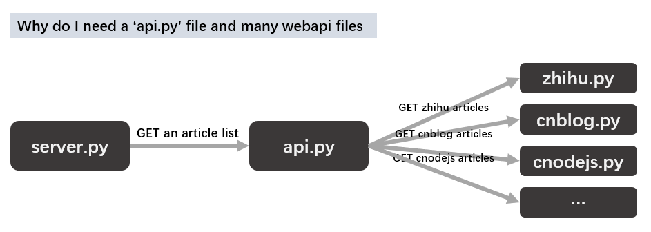
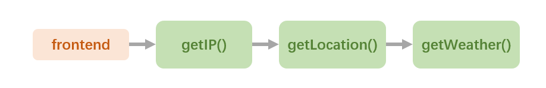
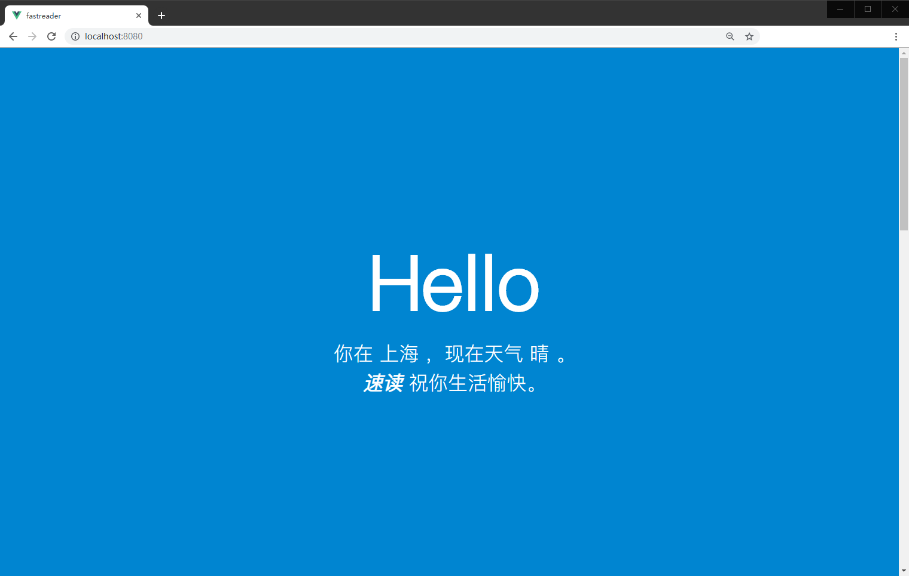
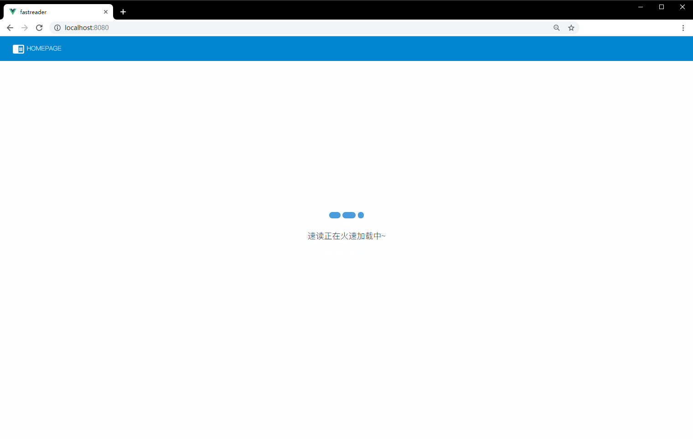
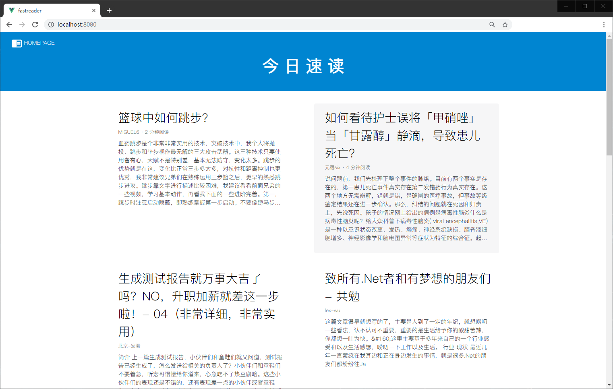
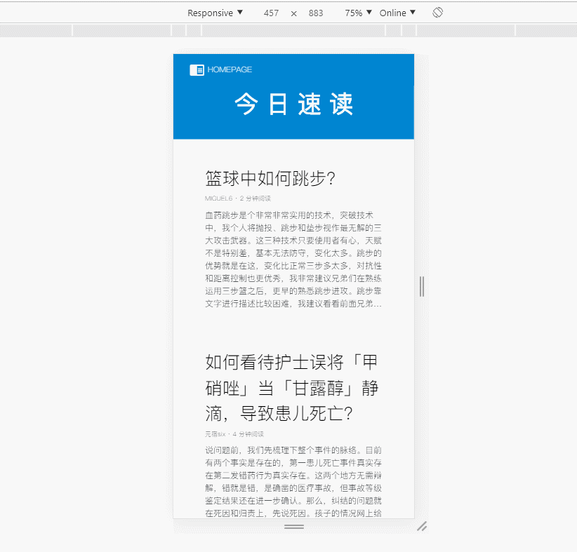
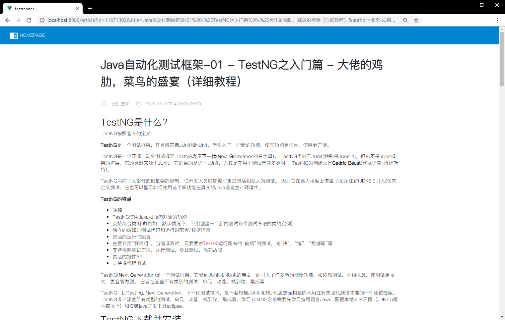

# QuickRead

**Author:** Zheng Chao

**Tutor:** Liu Yan

## 1. Background

QuickRead is a Information Intergration platform especially for programmers. Here we presents most read articles, hottest topics, latest news.

## 2. Architecture

### 2.1 Frontend

**Introduction** 

My front-end part is based on a vue-cli scaffolding. Vue basically helps me to build a view and view-model architecture. The structure is listed as below.

**Structure** 



- main.js => load some global scripts and start a vue app
- router.js => define the router of web pages
- **component** => including views and logical controller of the elements of frontend web pages
- **js** => **httpRequest.js** ==> packaged axios methods to send http request to backend
- **js** => **api.js** ==> packaged httpRequest to send specific request for a certain purpose

**Work Flow**



**Most Used Libraries**

1. **axios**

2. **jquery**

3. **bootstrap**
4. **animate,css**

### 2.2 Backend

**Introduction**

My back-end part is based on python flask.

I didn't choose Spring because I think it is better for a huge background project. Our backend is very easy and simple, so Spring MVC or even Spring boot will look fat and redundant, although Spring is such a wonderful frame for JAVA project, I still choose to abort it.

The structure of backend project is listed as below.

**Structure**



- server.py => start a flask app and define the routers in RESTful way
- **api.py** => integrate returned datas from web apis, and presents the ideal data for frontend
- **webapis** ==> **xxx.py** ==> each file means a resourse of a api provider.


**Work Flow**



**Most Used Libraries**

1. flask
2. request
3. json
4. re
5. html
6. beautifulSoup

## 3. Apis and integration

### 3.1 All of the web-apis I used

|          | BaseURL                            | Data Format |
| -------- | ---------------------------------- | ----------- |
| 知乎日报 | https://news-at.zhihu.com/api/4    | json        |
| 博客园   | http://wcf.open.cnblogs.com/blog   | xml         |
| CNodejs  | https://cnodejs.org/api/v1         | json        |
| 搜狐ip   | http://ip.taobao.com/service/      | json        |
| 和风天气 | https://free-api.heweather.net/s6/ | json        |

> For details, please read 'backend/webapis/' to see how they works.

### 3.2 My apis

| Method | Api                    | Purpose                                         |
| ------ | ---------------------- | ----------------------------------------------- |
| GET    | /api/topics            | Get all articles recommended.                   |
| GET    | /api/topic?params      | Get the detailed content for a certain article. |
| GET    | /api/city/:ip          | Get the position of user according to his ip.   |
| GET    | /api/weather/:location | Get the weather infomation for a certain city.  |

### 3.3 Integration

- **Get the article list**:

```python
def getTopics():
    topics=[]
    # zhihudaily
    zhihudaily_topics=zhihudaily.getTopics()
    print("正在获取zhihu的文章*"+str(len(zhihudaily_topics)))
    for e in zhihudaily_topics:
        topics.append(e)
    # cnblogs
    cnblog_topics=cnblog.getTopics()
    print("正在获取cnblogs的文章*"+str(len(cnblog_topics)))
    for e in cnblog_topics:
        topics.append(e)
    # cnodejs
    cnodejs_topics=cnodejs.getTopics()
    print("正在获取cnodejs的文章*"+str(len(cnodejs_topics)))
    for e in cnodejs_topics:
        topics.append(e)
    
    data = json.dumps(topics, ensure_ascii=False)
    return data
```

> Get articles from three websites, converting to a unitive formation like below
>
> ```python
> article = {
>     id:"",			# id
>     title:"",		# title
>     author:"",		# author
>     time:"",		# published time
>     from:"",		# source
> }
> ```

- **Get weather consitions:**



> The next operation is based on former request.


## 4. Difficulties and Solutions

### 4.1 The same-origin policy

At first, I was thinking about to seperates some js files so that I might be able to load my backend logics at frontend too!

But somehow, I was stucked at the CORS warning caused by The same-origin policy, which was caused during  the work of axios. All request will be intercepted by the browser, so you can't get the data because it is 'unsafe'.

A more easy way to deal with this problem is to set up a proxy. But considering the integrity of a project, I finally chose to set up the backend.

### 4.2 Coding rule

After I finally got the data I wanted from apis, and dealing, putting messages together, now I need to send the data back to the front-end.

I assigned json as our communicating mode, and I used the library called ```json``` to 'dump' datas to a json-like string. But after I received the data at the frontend, I found that the text was encoded in Unicode. And after a bunch of tests, I located the problem was caused by ```json.dumps()``` methods.

The difficulty lies in debugging procedure. Either ```print()``` to console or reading text by browser will not work because they will beautify the content, so you won't see the 'raw' content. So I have to print them all into a 'txt' file, and read.

### 4.3 Bad responsed data

I retrieve reading meterials from 3 different **unofficial** websites. All of the datas includes a long and redundant HTML text, and even worse, it contains many messy codes that I have tried a thousand of ways to make it looks better.

**Unnecessary blanks**

For example, the data from the site of 'cnblog' is a xml formatting file, but it contains many un-necessary blanks(like \<p> \</p>, or \<div>\</div>), and strange quotations anywhere.

**Escape code**

Some html texts are unable to show in browswer because the angle branckets for tags are transferred to escape codes. So I looked up for some information and chose ```html``` to do a parser job.

**Build in stylesheet**

Many data contains style attribute in their tags, and it destroyed the stylesheet of my own. Finally I used ```re``` to delete some(but not all) of them.

**Image loading problems**

Even if I have already pass my message from server to the frontend, including the 'src' attribute for image tags, some links will still goes in the way firstly connecting to server, and then ask the server to send request to the 'link'. I didn't figure it out untill now.

## 5. Display

### 5.1 Run

**Frontend**

1. Enter the path of frontend

```
cd frontend
```

2. Project setup

```
npm install
```

3. Compile and run

```
npm run serve
```

**Backend**

1. Enter the path of backend

```
cd backend
```

2. Start flask server

``` 
python flask.py
```

### 5.2 Screenshots


**Features**

- **Welcome page animation**

On loading the home page, it will automatically looks for the current ip for the user and looks for his location and weather.



- **Loading Animations**



- **Articles for today**

Highlighting the article where the pointer locates.



Adaptive page suitable for both mobile users and lap-top users.



- Detailed article page


